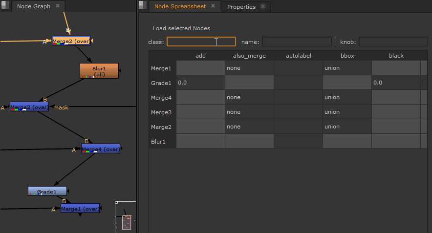

# Node Spreadsheet

A fork of [filmkorn/nuke_node_table](https://gitlab.com/filmkorn/nuke_node_table) by Mitja Mueller-Jend.

A spreadsheet-style panel for [Nuke](https://www.foundry.com/products/nuke) that lets you view and edit knobs across multiple selected nodes simultaneously.



## Changes from upstream

- Removed the `Qt.py` dependency — imports PySide6/PySide2/PySide directly based on Nuke version
- Added `menu.py` for simpler installation via `pluginAddPath`

## Features

- View knobs of all selected nodes in a table
- Edit knob values directly in the spreadsheet
- Filter nodes and knobs
- Works with nodes inside groups

## Setup

Clone or download this repo into your `~/.nuke/` directory, then add the following to your `~/.nuke/menu.py`:

```python
nuke.pluginAddPath('./nuke_node_table')
```

The Node Spreadsheet panel will be available under Nuke's panel menu.

## Compatibility

- Nuke 16+ (PySide6)
- Nuke 11–15 (PySide2)
- Nuke <11 (PySide)

## License

[MIT](license.txt)
